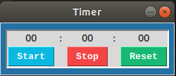

# The simplest timer app on this planet :

1. I couldn't find any timer app which would be very simple and take as less as possible window area.

2. I made it non resizable and very tiny. 

3. When I do contest programming it's important for me to make use of the screen as much as possible and also have a timer which will not take up so much space. So I built one which will serve this purpose and have no extra features.

4. Window view. 

5. Written in #Python and GUI is made by the python library #tkinter. 

# Instructions :

1. download or clone the project. 
2. if you don't have python tkinter on your pc install it using sudo apt. 
3. cd TimerApp.
4. type 'python3 timerapp.py' on the command line.
 
